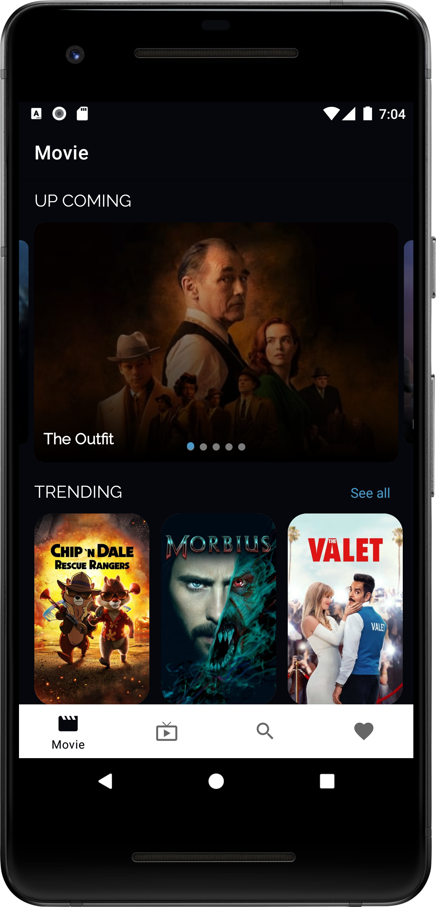
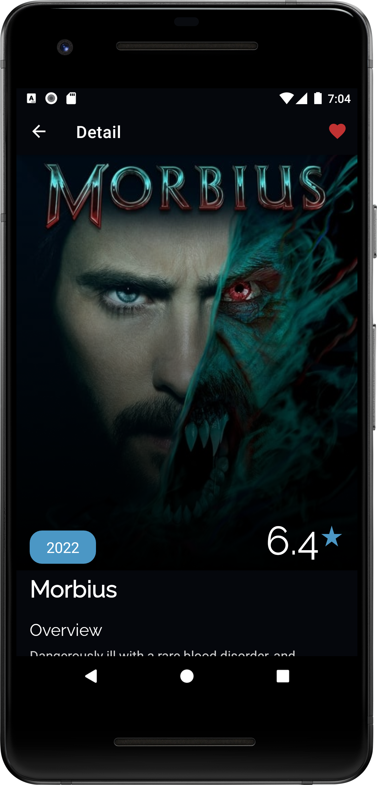
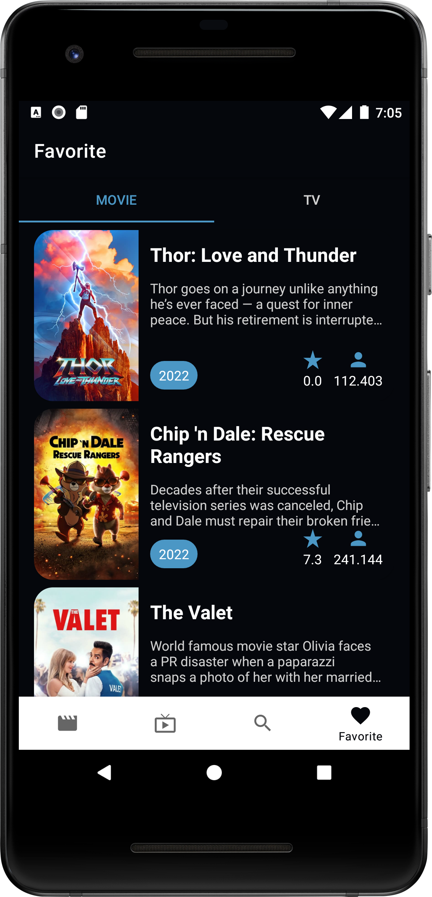

# TheMovieDB-App
Movie App use The Movie Database API

## Components:
- MVVM Achitecture
- Room - Flow
- Data Store - StateFlow
- Recyclerview
- Retrofit 2 - Gson - Coroutine
- Depedency injection - Degger Hilt
- Coil
- Shimmer
- Paging 3 integrated with Room
- BannerViewPager
- ViewBinding
- DataBinding
- LiveData
- Navigation Args - Safe Args

## Screenshot

  
  
  

